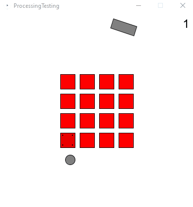

# Copilot Testing for a Natrual Language Programming Course

I spent about 90 minutes creating a simple game using processing and coplot, writing as little code as I could. My goal was to figure out how viable it would be to teach non-programmers to create software with copilot.

## Potential addordances:
* Copliot can generate a suprising amount of useful code based on comment directives in a relatively open-ended game.
  * > See the image below, and the code for it [here](ProcessingTesting.pde)
* I felt a genuine co-creation process. It had ideas that I used, and I had to shape it ideas in turn.
* Copilot is great at using an existing, well-know API like processing. I hadn't used processing in 10 years, but I could smoothly create without having to look up the API. This suggests that novices may also be able to write code via natural lanugage without any experience with the API.
  * > E.g., I could say "create a ball" and it would know what that meant. << BTW this is an example coplit suggested. I didn't write it.
* Copilot is *very* good at inferring reasonable defaults when things are underspecified. It's often not quite right, but reasonable enough to get a sense of whether the code is correct.
  * > E.g., I would say create a ball, and it would choose a reasonable starting point (center of the screen) and size and color

## Interesting opportunities for good pedagogy or UI:
* Students would need some structure to know where to put a comment and its corresponding code.
  * I could imagine teaching students how to break up an idea into "variables", "initialization", "update" and "drawing", or even creating a UI that scaffolds this with an "object oriented" bent.
  * The challenge is when novices think about things, they think about them all at once, not broken up "e.g. I want a ball that orbit the screen" actually requires code in 4 different places. Copilot can't directly edit code, so we'd need to add lines in a bunch of places. Do we teach this to students or do we try to do it for them?
* Copilot's current interface isn't really designed for iteration that way in ChatGPT you can say "now update that to be XX instead of YY".
  * I think this is a real opportunity to deveop some sort of wrapper to make it easier to iterate, modify and debug.
* Students might need to learn how and when to be more specific with their commands
  * > E.g., when do I say "create a ball" vs "create a ball in the center of the screen with a "
* Copilot has some interesting notions of art and how to connect natural language to code to graphics.
  * > E.g., when I asked it to make cracks appear in the bricks to show their damage, it decided to draw little dice pips. I think they're cute.

## Potential challenges:
* It took a lot of expert knowledge to create the game. While for some things I could just say "not create X and have it do Y", for the most part I had to already know how to structure the code and where to put what.
  * > E.g., this was very distracting when I wanted to create a new idea, and started a comment and copilot would start writing code that I didn't want. Like right now I have it activated for markdown :D and it told me to write "would start writing code that I didn't want." But actually I wanted to say "it would start writing a comment about the code below and distract me with its suggestion instead of letting me get a new thought in"
* Copilot wants things to look familiar. It aggressively suggests ideas that are standard.
  * > E.g., I wanted to make a circular paddle movement. Copilot really wanted me to make it axis-aligned
* Copilot often makes erroneous assumptions about more complex things like geometry.
  * > E.g. I had to hand-hold it through the logic of bouncing the ball off the paddle. It know what reflected angles looked like, but didn't understand that my angles described forward motion instead of normals.
* Debugging will be such a pain. Right now it essentially means "delete what copilot just wrote and try again". But that only works if the bug is localized to one area. What if it's a clash between two parts of my code? I really don't know how novices will handle this.
  * > E.g., When the paddle wasn't working correctly, I had to apply a lot of both programming and geometry knowledge to fix it. I don't know what we'd tell students in that case, other than to try something simpler.